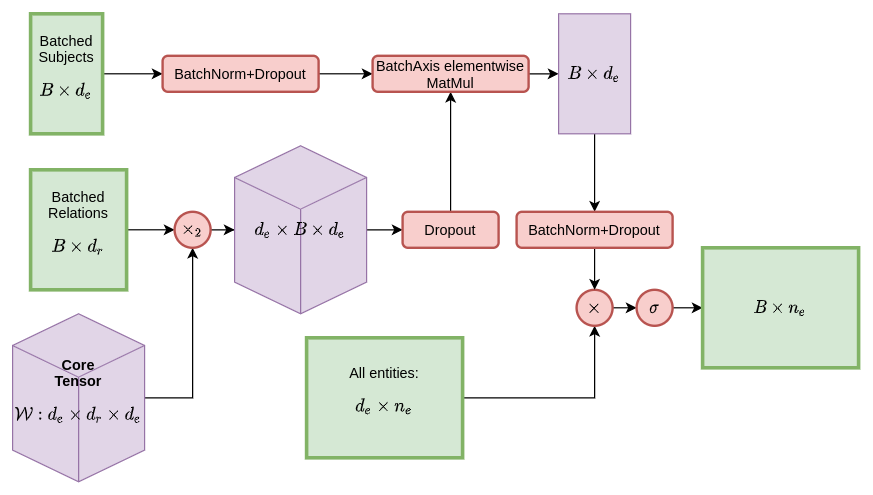

# TuckER

This is a project attempting to reproduce the results of the paper [TuckER: Tensor Factorization for Knowledge Graph Completion](https://arxiv.org/abs/1901.09590) by Balažević, Allen and Hospedales as part of the [Advanced Topics in Machine Learning](https://www.cs.ox.ac.uk/teaching/courses/2020-2021/advml/) course at the University of Oxford.

<p align="center">
  
  <em>Graphical overview of the system</em>
</p>

The code requires some external libraries, most notably [PyTorch](https://pytorch.org/).

## Using the `TuckER` class

This class fully supports batching.

```python
tucker = TuckER(num_entities, num_relations, initial_tensor, gradient_mask=None)
```

`initial_tensor` is what the `core_tensor` is initialized with. The `gradient_mask` entry must have the same shape as the `initial_tensor`. For most purposes, the user may leave the `gradient_mask` attribute as `None`. In such cases, it is initialized to a tensor of ones with the same shape as `initial_tensor`.

Example:

```python
tucker = TuckER(9, 9, np.random.normal(size=[3, 11, 3]).astype(np.float32), np.ones([3, 11, 3]).astype(np.float32))
output = tucker([0, 1], [5, 2])
print(output)
```

produces

```python
tensor([[1.3786e-02, 9.9045e-01, 2.6718e-02, 1.1845e-01, 7.9078e-01, 9.9812e-01,
         1.0000e+00, 4.2361e-03, 9.6301e-01],
        [9.9839e-01, 9.8582e-01, 1.3405e-05, 9.2480e-01, 9.9501e-01, 9.8919e-01,
         9.9992e-01, 4.7132e-01, 1.4876e-03]], grad_fn=<SigmoidBackward>)
```

## Training

### Locally

To run training locally with default parameters, use the prepared shell scripts:

```bash
cd training_scripts
./train_<DATASET>.sh
```

Alternatively, can use the [training script](training_scripts/train_script.py) to specify your own parameters.

### Remotely (Colab)

Open a new session with a GPU and then perform

```
!git clone https://github.com/sharan-dce/tucker.git
%cd training_scripts
!./train_<DATASET>.sh
```

## Using TuckER to implement other knowledge-graph completion algorithms

Here is where `gradient_mask` comes in.  Whichever values in the `core_tensor` should not be modified should have an entry of `0` in the `gradient_mask` and other values should be `1`.

### DistMult Model Calling

DistMult model can be called directly using the `TuckER` class. The calling approach is as follows:

```python
ini_tensor = np.zeros((4, 4, 4))  # (d_e, d_e, d_e)
ini_tensor[np.diag_indices(ini_tensor.shape[0], ndim=3)] = 1  # superdiagonal with 1s
model = TuckER(9, 9, ini_tensor, np.zeros_like(ini_tensor).astype(np.float32))
output = model([0, 1], [5, 2])
```

### RESCAL Model Calling
RESCAL model actually has no relation embedding so we implement a `RESCAL` class that inherits from `TuckER` instead of using TuckER directly.

```python
model = RESCAL(7, 8, np.random.normal(size=[3, 8, 3]).astype(np.float32))
output = model([0, 1], [0, 1])
```

## Documentation

See the [docs](docs/) to find more information about the project, our findings, results and extensions to the work done by the authors of the [original paper](https://arxiv.org/abs/1901.09590).
